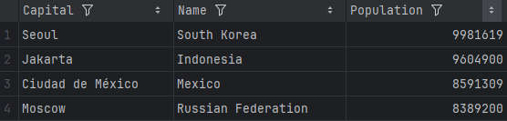

# Group One DevOps project

* Workflows 
* Master 
* Develop 
* 
* 
* 

## Members
* Kemar Hinds  - Developer
* Shannon Kane  - Scrum Master
* Nikolaos Koikas  - Developer
* Cam McVey  - Product Owner
* Danny Mutale  - Developer
* Tess Vaughan - Developer

## [Code of Conduct](CODE_OF_CONDUCT.md)

## Requirements Table 
### 32 requirements of 32 have been implemented, which is 100% 

| ID | Name                                                                                                  | Met | Screenshot | Link                                                                                                   |
|----|-------------------------------------------------------------------------------------------------------|-----|-|--------------------------------------------------------------------------------------------------------|
| 1  | All the countries in the world organised by largest population to smallest.                           | Yes |  | [PopulationOfCountries](tmp/PopulationOfCountries.csv)                                                 |
| 2  | All the countries in a continent organised by largest population to smallest.                         | Yes | |[PopulationOfContinentsByCountry.csv](tmp%2FPopulationOfContinentsByCountry.csv)                                                                                                        |
| 3  | All the countries in a region organised by largest population to smallest.                            | Yes |  | [Region-CountrybyLargestPopulation](tmp/Region-CountrybyLargestPopulation.csv)                         |
| 4  | The top N populated countries in the world where N is provided by the user.                           | Yes |  | [TopCountriesPerPopulation](tmp/TopCountriesPerPopulation.csv)                                         |
| 5  | The top N populated countries in a continent where N is provided by the user.                         | Yes | |[PopulationOfContinentsByCountryWithLimit.csv](tmp%2FPopulationOfContinentsByCountryWithLimit.csv)                                                                                                        |
| 6  | The top N populated countries in a region where N is provided by the user.                            | Yes |  | [PopulationOfRegionsByCountryWithLimit.csv](tmp%2FPopulationOfRegionsByCountryWithLimit.csv)           
| 7  | All the cities in the world organised by largest population to smallest.                              | Yes |  | [PopulationOfCities.csv](tmp%2FPopulationOfCities.csv)                                                 
| 8  | All the cities in a continent organised by largest population to smallest.                            | Yes |  | [CitiesByContinent.csv](tmp%2FCitiesByContinent.csv)                                                   
| 9  | All the cities in a region organised by largest population to smallest.                               | Yes |  | [CitiesByRegion.csv](tmp%2FCitiesByRegion.csv)                                                         
| 10 | All the cities in a country organised by largest population to smallest.                              | Yes | |[CitiesByCountry.csv](tmp%2FCitiesByCountry.csv)                                                       
| 11 | All the cities in a district organised by largest population to smallest.                             | Yes |  | [CitiesByDistrict.csv](tmp%2FCitiesByDistrict.csv)                                                     
| 12 | The top N populated cities in the world where N is provided by the user.                              | Yes |  | [TopCitiesPerPopulation.csv](tmp%2FTopCitiesPerPopulation.csv)                                         
| 13 | The top N populated cities in a continent where N is provided by the user.                            | Yes |  | [TopCitiesByContinent.csv](tmp%2FTopCitiesByContinent.csv)                                             
| 14 | The top N populated cities in a region where N is provided by the user.                               | Yes |  | [TopCitiesByRegion.csv](tmp%2FTopCitiesByRegion.csv)                                                   
| 15 | The top N populated cities in a country where N is provided by the user.                              | Yes |  | [TopCitiesByCountry.csv](tmp%2FTopCitiesByCountry.csv)                                                 
| 16 | The top N populated cities in a district where N is provided by the user.                             | Yes | | [TopCitiesByDistrict.csv](tmp%2FTopCitiesByDistrict.csv)                                               
| 17 | All the capital cities in the world organised by largest population to smallest.                      | Yes |  | [PopulationOfCapitalCities.csv](tmp%2FPopulationOfCapitalCities.csv)                                   
| 18 | All the capital cities in a continent organised by largest population to smallest.                    | Yes |  | [CapitalCitiesInContinentByPopulation.csv](tmp%2FCapitalCitiesInContinentByPopulation.csv)             
| 19 | All the capital cities in a region organised by largest to smallest.                                  | Yes |  | [CapitalCitiesInRegionByPopulation.csv](tmp%2FCapitalCitiesInRegionByPopulation.csv)                   
| 20 | The top N populated capital cities in the world where N is provided by the user.                      | Yes |  | [TopCapitalCitiesPerPopulation.csv](tmp%2FTopCapitalCitiesPerPopulation.csv)                           
| 21 | The top N populated capital cities in a continent where N is provided by the user.                    | Yes |  | [CapitalCitiesInContinentWithLimit.csv](tmp%2FCapitalCitiesInContinentWithLimit.csv)                   
| 22 | The top N populated capital cities in a region where N is provided by the user.                       | Yes |  | [CapitalCitiesInRegionWithLimit.csv](tmp%2FCapitalCitiesInRegionWithLimit.csv)                         
| 23 | The population of people, people living in cities, and people not living in cities in each continent. | Yes |  | [PopulationLivingNotLivingInCitiesPerContinent](tmp/PopulationLivingNotLivingInCitiesPerContinent.csv) 
| 24 | The population of people, people living in cities, and people not living in cities in each region.    | Yes |  | [PopulationLivingNotLivingInCitiesPerRegion](tmp/PopulationLivingNotLivingInCitiesPerRegion.csv)       
| 25 | The population of people, people living in cities, and people not living in cities in each country.   | Yes |  | [PopulationLivingNotLivingInCitiesPerCountry](tmp/PopulationLivingNotLivingInCitiesPerCountry.csv)     
| 26 | The population of the world.                                                                          | Yes |  | [TotalPopulationInWorld](tmp/TotalPopulationInWorld.csv)                                               
| 27 | The population of a continent.                                                                        | Yes |  | [TotalPopulationInContinent](tmp/TotalPopulationInContinent.csv)                                       
| 28 | The population of a region.                                                                           | Yes |  | [TotalPopulationInRegion](tmp/TotalPopulationInRegion.csv)                                             
| 29 | The population of a country.                                                                          | Yes |  | [TotalPopulationInCountry](tmp/TotalPopulationInCountry.csv)                                           
| 30 | The population of a district.                                                                         | Yes |  | [TotalPopulationInDistrict](tmp/TotalPopulationInDistrict.csv)                                         
| 31 | The population of a city.                                                                             | Yes |  | [TotalPopulationInCity](tmp/TotalPopulationInCity.csv)                                                 
| 32 | Report for specific languages in population, greatest to smallest with % of world population.         | Yes |  | [LanguageWorldPerPopulation](tmp/LanguageWorldPerPopulation.csv)                                       

## Workflow
* Decide which user story to work on for next sprint
* Create new sprint/assign to sprint on Zube
* Add user story card(s) to Ready column in Zube
* Add any additional task cards to Zube and put in priority order
* Pull the latest develop branch. 
* Start a new feature branch for the user story/task
* Select task to work on in Zube
* Work on task
* Once feature is finished, create JAR file. 
* Update and test Docker configuration with Travis
* Update feature branch with develop to ensure feature is up-to-date. 
* Check feature branch still works. 
* Merge feature branch into develop. 
* Repeat 5-14 until release is ready. 
* Merge develop branch into release and create release.
* Merge release into master and develop.
* Close the sprint
